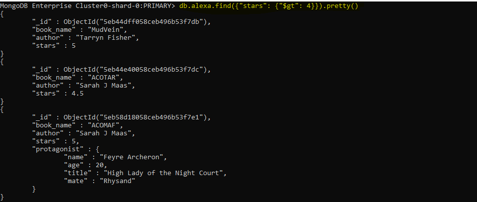
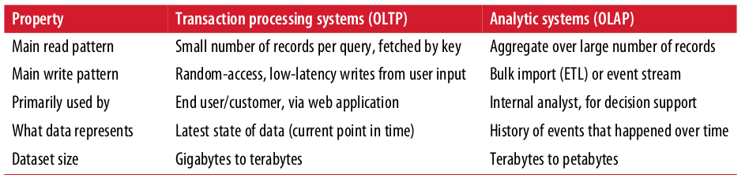
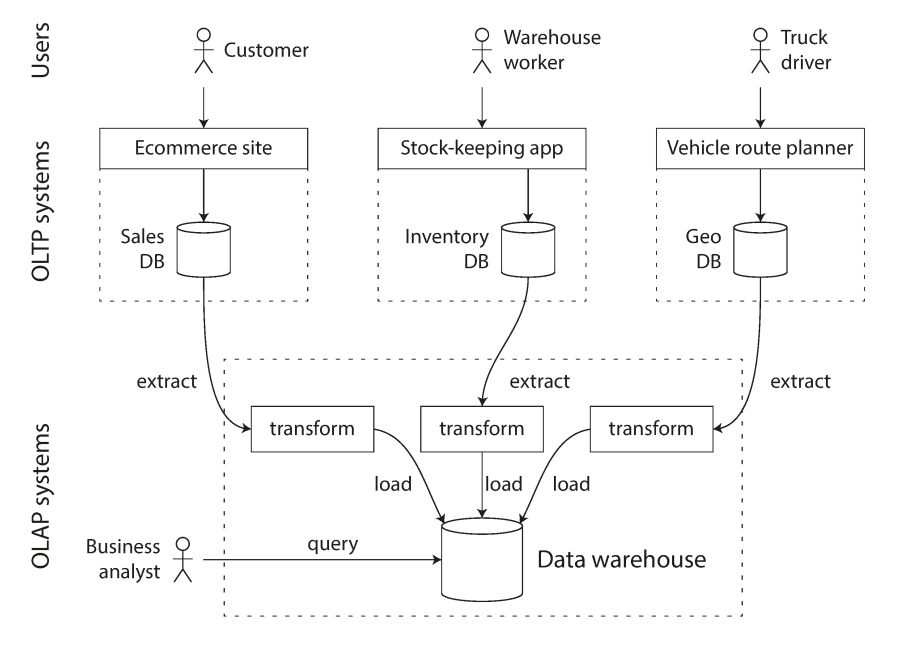
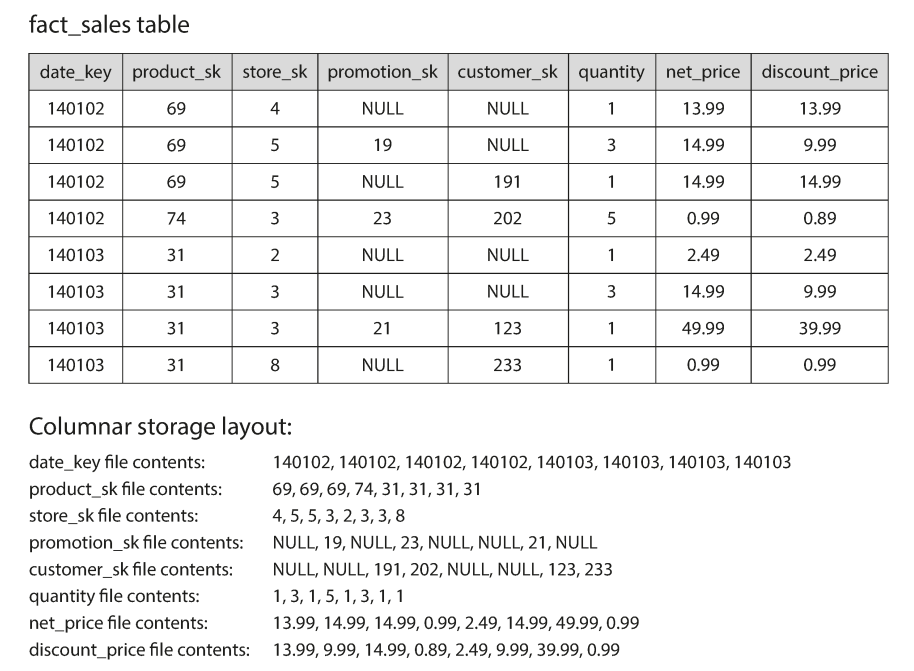

# Designing Data-Intensive Applications
 
## Chapter 2: Data Models and Query Languages

### 1.  What do you consider that even though there were new data store approaches, the relational model dominate them?
The use of business data processing, which was performed on mainframe computers in the 1960s and ’70s. Other databases at that time forced application developers to think a lot about the internal representation of the data in the database. The goal of the relational model was to hide that implementation detail behind a cleaner interface.

### 2. What were the necessities that drove the creation of NoSQL databases?
- A need for greater scalability than relational databases can easily achieve, including
very large datasets or very high write throughput.
- A widespread preference for free and open source software over commercial
database products.
- Specialized query operations that are not well supported by the relational model.
- Frustration with the restrictiveness of relational schemas, and a desire for a more
dynamic and expressive data model.

### 3. Mention five Object-relational mapping (ORM) frameworks (different from the book).
(answers may vary)
- Apache Cayenne (Java implementation of Active record pattern, inspired by Ruby on Rails).
- DataNucleus (open-source JDO and JPA implementation, formerly known as JPOX).
- Ebean (open-source).
- EclipseLink (Eclipse persistence platform).
- Enterprise JavaBeans (EJB).

### 4. Imagine you are creating a relational database and you are now creating a table for shipping orders, using the many-to-many relationships how would you create your table?


### 5. Describe each of the proposed solutions for the limitation of the hierarchical model.
- **Network model:** A record could have multiple parents. The links between records in the network model were not foreign keys, but more like pointers in a programming language The only way of accessing a record was to follow a path from a root record along these chains of links. This was called an access path.
- **Relational model:** A relation (table) is simply a collection of tuples (rows). The query optimizer automatically decides which parts of the query to execute in which order, and which indexes to use.

### 6. What is "schema-on-read" and "schema-on-write"?
Schema-on-read is the structure of the data is implicit, and only interpreted when the data is read and schema-on-write is the traditional approach of relational databases, where the schema is explicit and the database ensures all written data conforms to it.

### 7. Create a  query (using imperative code) to get the books written by "Sarah J. Maas", that have more than 500 pages and where released after 2011.
```
function Getbooks(books) {
 var SarahJbooks = [];
 for (var i = 0, i < books.length, i++) {
     if (books[i].author === "Sarah J. Maas") &&  (books[i].pages > 500) && (books[i].released > 2011) {
        SaraJbooks.push(books[i]);
       }
     }
 return SarahJbooks;
}
```

### 8. What are the advantages and disadvantages for declarative query language and imperative query language?
|             | Advantages                                                                                                                                                                                                                   | Disadvantages                                                                                                                                                                                                                  |
|:-----------:|------------------------------------------------------------------------------------------------------------------------------------------------------------------------------------------------------------------------------|--------------------------------------------------------------------------------------------------------------------------------------------------------------------------------------------------------------------------------|
|  Imperative | Easy to read, relatively easy to learn, conceptual model (solution path) is very easy for beginners to understand and characteristics of specific applications can be taken into account                                     | Code quickly becomes very extensive and thus confusing, higher risk of errors when editing, system-oriented programming means that maintenance blocks application development and optimization and extension is more difficult |
| Declarative | Efficient code, can be implemented using methods not yet known at the time of programming, easy optimization as implementation is controlled by an algorithm and maintenance possible independent of application development | Sometimes hard to understand for external people, based on an unfamiliar conceptual model for people (solution state) and hard to take characteristics of individual applications into account during programming              |

### 9. What is MapReduce querying?
The logic of the query is expressed with snippets of code, which are called repeatedly by the processing framework. It is based on the map (also known as collect) and reduce (also known as fold or inject) functions that exist in many functional programming languages.

### 10. Investigate and describe 5 graph databases. 
- **Neo4j:** Open-source, supports ACID, has high-availability clustering for enterprise deployments, and comes with a web-based administration that includes full transaction support and visual node-link graph explorer; accessible from most programming languages using its built-in REST web API interface, and a proprietary Bolt protocol with official drivers.
- **OrientDB:** Second-generation distributed graph database with the flexibility of documents in one product (i.e., it is both a graph database and a document NoSQL database).
- **ArangoDB:** NoSQL native multi-model database system developed by ArangoDB Inc. The database system supports three important data models (key/value, documents, graphs) with one database core and a unified query language called AQL (ArangoDB Query Language).
- **Amazon Neptune:** Amazon Neptune is a fully managed graph database by Amazon.com. It is used as a web service and is part of Amazon Web Services. Supports popular graph models property graph and W3C’s RDF, and their respective query languages Apache TinkerPop Gremlin and SPARQL
- **AllegroGraph:** Resource Description Framework (RDF) and graph database.

### 11. Imagine if we put graph data in a relational structure, can we also query it using SQL?
Yes, but with some difficulty. In a relational database, you usually know in advance which joins you need in your query. In a graph query, you may need to traverse a variable number of edges before you find the vertex you’re looking for, i.e. the number of joins is not fixed in advance.

### 12. Create an example of cypher query.
```
LOAD CSV WITH HEADERS FROM “https://raw.githubusercontent.com/neo4j/neo4j/2.3/manual/cypher/cypherdocs/src/docs/graphgists/querytuning/movies.csv” AS line 
MERGE (m:Movie {title:line.title}) 
ON CREATE SET m.released = toInt(line.released), m.tagline = line.tagline
```
### 13. What are Triple-Stores?
In a triple-store, all information is stored in the form of very simple three-part statements:v(subject, predicate, object). For example, in the triple (Jim, likes, bananas), Jim is the subject, likes is the predicate (verb), and bananas is the object.

### 14. Write an example of SPARQL query.
```
PREFIX : <urn:example:>

SELECT ?personName WHERE {
?person :name ?personName.
?person :bornIn / :within* / :name "United States".
?person :livesIn / :within* / :name "Europe".
}
```

### 15. Describe Datalog.
Datalog’s data model is similar to the triple-store model, generalized a bit. Instead of writing a triple as (subject, predicate, object), we write it as predicate(subject, object).

 
## Chapter 3: Storage and Retrieval

### 1. How does indexes affect databases?
Indexes speed up read queries, but every index slows down writes.

### 2. How does a hash table works?
Hash Table is a data structure which stores data in an associative manner. In a hash table, data is stored in an array format, where each data value has its own unique index value. Access of data becomes very fast if we know the index of the desired data.
Thus, it becomes a data structure in which insertion and search operations are very fast irrespective of the size of the data. Hash Table uses an array as a storage medium and uses hash technique to generate an index where an element is to be inserted or is to be located from.


### 3. Advantages and disadvantages of Bitcask
| Advantages                                                                  | Disadvantages           |
|-----------------------------------------------------------------------------|-------------------------|
| Low latency per item read or written                                        | Keys must fit in memory |
| High throughput, especially when writing an incoming stream of random items |                         |
| Ability to handle datasets larger than RAM without degradation              |                         |
| Single seek to retrieve any value                                           |                         |
| Predictable lookup and insert performance                                   |                         |
| Fast, bounded crash recovery                                                |                         |
| Easy Backup                                                                 |                         |

### 4. How do we avoid eventually running out of disk space?
A good solution is to break the log into segments of a certain size by closing a segment file when it reaches a certain size, and making subsequent writes to a new segment file. We can then perform compaction on these segments, as illustrated in the picture below. Compaction means throwing away duplicate keys in the log, and keeping only the most recent update for each key.


### 5. Write a comparision table about B-Trees and LSM-Trees
|                                  B-Trees                                   |                                              LSM-Trees                                             |
|:--------------------------------------------------------------------------:|:--------------------------------------------------------------------------------------------------:|
| More mature implementations                                                | Not mature enough                                                                                  |
| Not interesting enough                                                     | Interesting due to their performance characteristic                                                |
| faster for reads                                                           | faster for writes                                                                                  |
| A B-tree index must write every piece of data at least twice               | Sequentially write compact SSTable files rather than having to overwrite several pages in the tree |
| B-tree storage engines leave some disk space unused due to fragmenta‐ tion | Can be compressed better                                                                           |
| Each key exists in exactly one place in the index                          | May have multiple copies of the same key in different segments.                                    |

### 6. What are the difference between OLTP and OLAP?


### 7. What is a data warehouse?
Is a separate database that analysts can query to their earts’ content, without affecting OLTP operations [48]. The data warehouse conains a read-only copy of the data in all the various OLTP systems in the company.

### 8. What is Extract–Transform–Load (ETL)?
Data is extracted from OLTP databases (using either a periodic data dump or a continuous stream of updates), transformed into an analysis-friendly schema, cleaned up, and then loaded into the data warehouse.


### 9. What is star schema?
When the table relationships are visualized, the fact table is in the middle, surrounded by its dimension tables; the connections to these tables are like the rays of a star.

### 10. What is snowflake schema?
where dimensions are further broken down into subdimensions. For example, there could be separate tables for brands and product categories, and each row in the dim_product table could reference the brand and category as foreign keys, rather than storing them as strings in the dim_product table. Snowflake schemas are more normalized than star schemas, but star schemas are often preferred because they are simpler for analysts to work with.

### 11. What is th idea of column-oriented storage?
Don’t store all the values from one row together, but store all the values from each column together instead. If each column is stored in a separate file, a query only needs to read and parse those columns that are used in that query, which can save a lot of work. This principle is illustrated in the image below.


### 12. Investigate other algorithms for columns compression and describe them.
- **Dictionary Encoding:** hese schemes replace frequent patterns with smaller codes. A column-optimized variant of dictionary encoding is new Implementation. Row oriented datastores are basically not capable of blending attributes from more than one tuple in a single entry thus making dictionary encoding schemes not to function fully as they can only map attribute values from a single tuple to dictionary entries.
- **Run Length Encoding (RLE):** Compresses based on the idea of replacing the same long sequence in a column to a compact singular representation. Thus, it is well-suited for columns that are sorted or that have reasonable-sized runs of the same value. These runs are replaced with triples: (value, start position, run length) where each element of the triple is given a fixed number of bits. In row-oriented systems, RLE is only used for large string attributes that have many blanks or repeated characters. But in column oriented RLE can be much more greatly used systems where attributes are stored consecutively and runs of the same value are common (mainly in columns that have less distinct values).
- **Null Suppression:** Null compression scheme has many variants but the basic logic is to replace consecutive zeros or blanks in the data are deleted and replaced with a description of how many there were and where they existed. Naturally, this technique works great on data sets where zeros or blanks appear frequently. Variable field sizes are encoded in the number of bytes needed to store each field in a field prefix. This allows us to exclude heading nulls needed to pad the data to a fixed size. For example, for integer types, rather than using the full 4 bytes to store the integer, we encoded the exact number of bytes needed using two bits (1, 2, 3, or4 bytes) and placed these two bits as prefix of the integer.
- **Lempel-Ziv Encoding:** The Lempel-Ziv compression algorithms were developed in 1977-78. Lempel-Ziv compression is the most widely used technique for lossless file compression. The UNIX command gzip is based upon this algorithm only. Lempel-Ziv replaces variable sized patterns with fixed length codes unlike to Huffman encoding which produces variable sized codes. In Lempel-Ziv encoding knowledge about pattern frequencies in advance is not an requirement as it builds the pattern table dynamically as it encodes the data. The main idea is to analyse the input sequence into non-overlapping blocks of different lengths and constructing a dictionary of blocks seen thus far. Later on occurrences of these blocks are replaced by a pointer to an earlier occurrence of the same block.
- **Hybrid Columnar Compression:** Typically, a row is fully contained in a block, and the columns of the row stored next to each other. But too large rows can't fit in a block so results in spanning of the row to next block known as row chaining—but there is no change in the organization of the columns being stored next to each other. This compression mechanism replaces a value in a row with a much smaller symbol, thus reducing the length of the row. A great deal of compression can be achieved by replacing the repeated value with a much smaller symbol. In Hybrid Columnar Compression, we get a column vector for each column, compress the column vectors, and store the column vectors in data blocks. This collection of data blocks is known a compression unit. The blocks in a compression unit contain all the columns for a set of rows

**References:** 
- https://www.ionos.com/digitalguide/websites/web-development/imperative-programming/
- https://www.ionos.com/digitalguide/websites/web-development/declarative-programming/
- https://neo4j.com/graphgist/advanced-query-tuning-example
- https://en.m.wikipedia.org/wiki/Graph_database
- https://www.tutorialspoint.com/data_structures_algorithms/hash_data_structure.htm
- https://docs.riak.com/riak/kv/2.2.3/setup/planning/backend/bitcask/index.html
- http://www.rroij.com/open-access/a-short-survey-of-data-compression-techniques-for-column-oriented-databases-43-46.php?aid=38816
