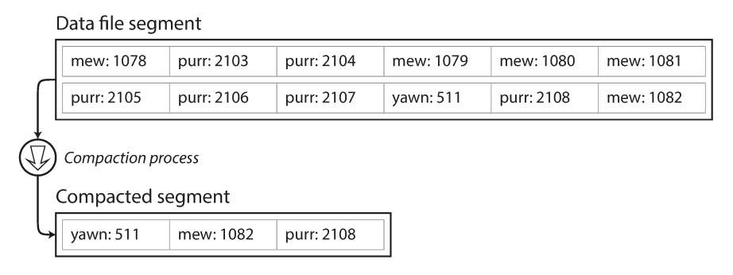

# Designing Data-Intensive Applications
 
## Chapter 2: Data Models and Query Languages

### 1.  What do you consider that even though there were new data store approaches, the relational model dominate them?
The use of business data processing, which was performed on mainframe computers in the 1960s and ’70s. Other databases at that time forced application developers to think a lot about the internal representation of the data in the database. The goal of the relational model was to hide that implementation detail behind a cleaner interface.

### 2. What were the necessities that drove the creation of NoSQL databases?
- A need for greater scalability than relational databases can easily achieve, including
very large datasets or very high write throughput.
- A widespread preference for free and open source software over commercial
database products.
- Specialized query operations that are not well supported by the relational model.
- Frustration with the restrictiveness of relational schemas, and a desire for a more
dynamic and expressive data model.

### 3. Mention five Object-relational mapping (ORM) frameworks (different from the book).
(answers may vary)
- Apache Cayenne (Java implementation of Active record pattern, inspired by Ruby on Rails).
- DataNucleus (open-source JDO and JPA implementation, formerly known as JPOX).
- Ebean (open-source).
- EclipseLink (Eclipse persistence platform).
- Enterprise JavaBeans (EJB).

### 4. Imagine you are creating a relational database and you are now creating a table for shipping orders, using the many-to-many relationships how would you create your table?


### 5. Describe each of the proposed solutions for the limitation of the hierarchical model.
- **Network model:** A record could have multiple parents. The links between records in the network model were not foreign keys, but more like pointers in a programming language The only way of accessing a record was to follow a path from a root record along these chains of links. This was called an access path.
- **Relational model:** A relation (table) is simply a collection of tuples (rows). The query optimizer automatically decides which parts of the query to execute in which order, and which indexes to use.

### 6. What is "schema-on-read" and "schema-on-write"?
Schema-on-read is the structure of the data is implicit, and only interpreted when the data is read and schema-on-write is the traditional approach of relational databases, where the schema is explicit and the database ensures all written data conforms to it.

### 7. Create a  query (using imperative code) to get the books written by "Sarah J. Maas", that have more than 500 pages and where released after 2011.
```
function Getbooks(books) {
 var SarahJbooks = [];
 for (var i = 0, i < books.length, i++) {
     if (books[i].author === "Sarah J. Maas") &&  (books[i].pages > 500) && (books[i].released > 2011) {
        SaraJbooks.push(books[i]);
       }
     }
 return SarahJbooks;
}
```

### 8. What are the advantages and disadvantages for declarative query language and imperative query language?
|             | Advantages                                                                                                                                                                                                                   | Disadvantages                                                                                                                                                                                                                  |
|:-----------:|------------------------------------------------------------------------------------------------------------------------------------------------------------------------------------------------------------------------------|--------------------------------------------------------------------------------------------------------------------------------------------------------------------------------------------------------------------------------|
|  Imperative | Easy to read, relatively easy to learn, conceptual model (solution path) is very easy for beginners to understand and characteristics of specific applications can be taken into account                                     | Code quickly becomes very extensive and thus confusing, higher risk of errors when editing, system-oriented programming means that maintenance blocks application development and optimization and extension is more difficult |
| Declarative | Efficient code, can be implemented using methods not yet known at the time of programming, easy optimization as implementation is controlled by an algorithm and maintenance possible independent of application development | Sometimes hard to understand for external people, based on an unfamiliar conceptual model for people (solution state) and hard to take characteristics of individual applications into account during programming              |

### 9. What is MapReduce querying?
The logic of the query is expressed with snippets of code, which are called repeatedly by the processing framework. It is based on the map (also known as collect) and reduce (also known as fold or inject) functions that exist in many functional programming languages.

### 10. Investigate and describe 5 graph databases. 
- **Neo4j:** Open-source, supports ACID, has high-availability clustering for enterprise deployments, and comes with a web-based administration that includes full transaction support and visual node-link graph explorer; accessible from most programming languages using its built-in REST web API interface, and a proprietary Bolt protocol with official drivers.
- **OrientDB:** Second-generation distributed graph database with the flexibility of documents in one product (i.e., it is both a graph database and a document NoSQL database).
- **ArangoDB:** NoSQL native multi-model database system developed by ArangoDB Inc. The database system supports three important data models (key/value, documents, graphs) with one database core and a unified query language called AQL (ArangoDB Query Language).
- **Amazon Neptune:** Amazon Neptune is a fully managed graph database by Amazon.com. It is used as a web service and is part of Amazon Web Services. Supports popular graph models property graph and W3C’s RDF, and their respective query languages Apache TinkerPop Gremlin and SPARQL
- **AllegroGraph:** Resource Description Framework (RDF) and graph database.

### 11. Imagine if we put graph data in a relational structure, can we also query it using SQL?
Yes, but with some difficulty. In a relational database, you usually know in advance which joins you need in your query. In a graph query, you may need to traverse a variable number of edges before you find the vertex you’re looking for, i.e. the number of joins is not fixed in advance.

### 12. Create an example of cypher query.
```
LOAD CSV WITH HEADERS FROM “https://raw.githubusercontent.com/neo4j/neo4j/2.3/manual/cypher/cypherdocs/src/docs/graphgists/querytuning/movies.csv” AS line 
MERGE (m:Movie {title:line.title}) 
ON CREATE SET m.released = toInt(line.released), m.tagline = line.tagline
```
### 13. What are Triple-Stores?
In a triple-store, all information is stored in the form of very simple three-part statements:v(subject, predicate, object). For example, in the triple (Jim, likes, bananas), Jim is the subject, likes is the predicate (verb), and bananas is the object.

### 14. Write an example of SPARQL query.
```
PREFIX : <urn:example:>

SELECT ?personName WHERE {
?person :name ?personName.
?person :bornIn / :within* / :name "United States".
?person :livesIn / :within* / :name "Europe".
}
```

### 15. Describe Datalog.
Datalog’s data model is similar to the triple-store model, generalized a bit. Instead of writing a triple as (subject, predicate, object), we write it as predicate(subject, object).

 
## Chapter 3: Storage and Retrieval

### 1. How does indexes affect databases?
Indexes speed up read queries, but every index slows down writes.

### 2. How does a hash table works?
Hash Table is a data structure which stores data in an associative manner. In a hash table, data is stored in an array format, where each data value has its own unique index value. Access of data becomes very fast if we know the index of the desired data.
Thus, it becomes a data structure in which insertion and search operations are very fast irrespective of the size of the data. Hash Table uses an array as a storage medium and uses hash technique to generate an index where an element is to be inserted or is to be located from.


### 3. Advantages and disadvantages of Bitcask
| Advantages                                                                  | Disadvantages           |
|-----------------------------------------------------------------------------|-------------------------|
| Low latency per item read or written                                        | Keys must fit in memory |
| High throughput, especially when writing an incoming stream of random items |                         |
| Ability to handle datasets larger than RAM without degradation              |                         |
| Single seek to retrieve any value                                           |                         |
| Predictable lookup and insert performance                                   |                         |
| Fast, bounded crash recovery                                                |                         |
| Easy Backup                                                                 |                         |

### 4. How do we avoid eventually running out of disk space?
A good solution is to break the log into segments of a certain size by closing a segment file when it reaches a certain size, and making subsequent writes to a new segment file. We can then perform compaction on these segments, as illustrated in the picture below. Compaction means throwing away duplicate keys in the log, and keeping only the most recent update for each key.


**References:** 
- https://www.ionos.com/digitalguide/websites/web-development/imperative-programming/
- https://www.ionos.com/digitalguide/websites/web-development/declarative-programming/
- https://neo4j.com/graphgist/advanced-query-tuning-example
- https://en.m.wikipedia.org/wiki/Graph_database
- https://www.tutorialspoint.com/data_structures_algorithms/hash_data_structure.htm
- https://docs.riak.com/riak/kv/2.2.3/setup/planning/backend/bitcask/index.html
