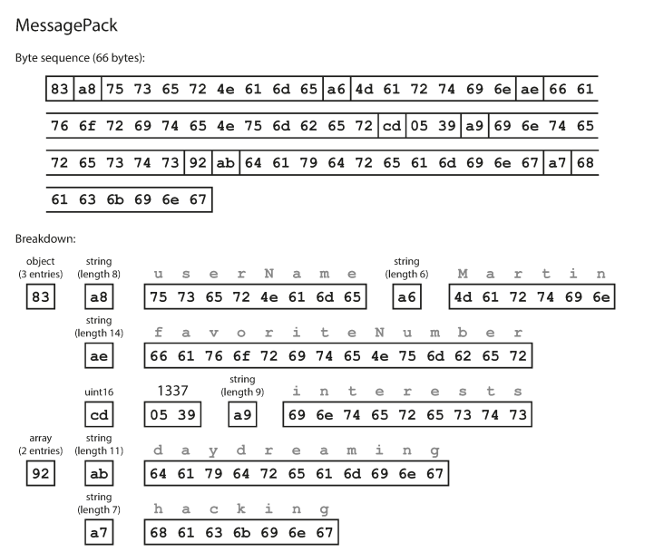

# Designing Data-Intensive Applications
 
## Chapter 4: Encoding and Evolution

### 1. In order for the system to continue running smoothly, what do we need to do?
Maintain compatibility in both directions:
- **Backward compatibility:** Newer code can read data that was written by older code.
- **Forward compatibility:** Older code can read data that was written by newer code.

### 2. How encoding data helps with schema felxibility?
They handle schema changes and support systems where old and new data and code need to coexist. 

### 3. Summarize the problems of using encoding libraries.
- The encoding is often tied to a particular programming language, and reading the data in another language is very difficult. 
- In order to restore data in the same object types, the decoding process needs to be able to instantiate arbitrary classes.
- Versioning data is often an afterthought in these libraries: as they are intended for quick and easy encoding of data, they often neglect the inconvenient problems of forward and backward compatibility.
- Efficiency (CPU time taken to encode or decode, and the size of the encoded structure).

### Example of a record encoded using MessagePack.

