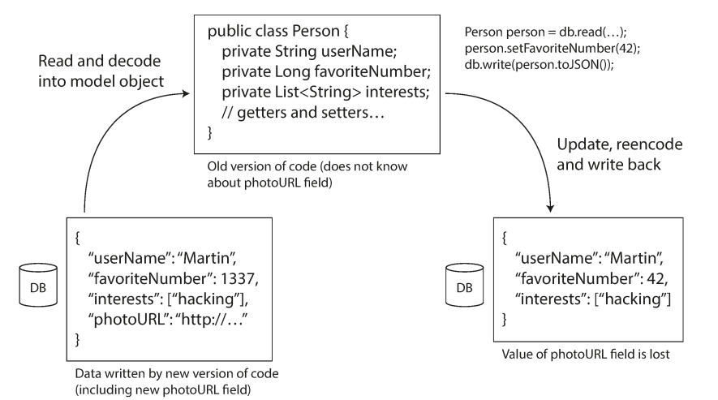

# Designing Data-Intensive Applications
 
## Chapter 4: Encoding and Evolution

### 1. In order for the system to continue running smoothly, what do we need to do?
Maintain compatibility in both directions:
- **Backward compatibility:** Newer code can read data that was written by older code.
- **Forward compatibility:** Older code can read data that was written by newer code.

### 2. How encoding data helps with schema felxibility?
They handle schema changes and support systems where old and new data and code need to coexist. 

### 3. Summarize the problems of using encoding libraries.
- The encoding is often tied to a particular programming language, and reading the data in another language is very difficult. 
- In order to restore data in the same object types, the decoding process needs to be able to instantiate arbitrary classes.
- Versioning data is often an afterthought in these libraries: as they are intended for quick and easy encoding of data, they often neglect the inconvenient problems of forward and backward compatibility.
- Efficiency (CPU time taken to encode or decode, and the size of the encoded structure).

### 4. Example of a record encoded using MessagePack (different from the book).

### 5. Make a comparison table of Thrift vs Protocol Buffer.
|                     |                               Thrift                               |                                   Protocol Buffer                                   |
|---------------------|:------------------------------------------------------------------:|:-----------------------------------------------------------------------------------:|
| Features            | Richer feature set, but varies from language to language/          | Fewer features but robust implementations.                                          |
| Performance         | Not a differentiator/                                              | Marginally better than Thrift, if at all.                                           |
| Code Quality/Design | Haphazard development; design that works but not necessarily well. | Better designed, extensible and robust.                                             |
| Open-ness           | Apache project.                                                    | Open mailing list, code base and issue tracker but Google still drives development. |
| Documentation       | Severely lacking, but catching up.                                 | Excellent documentation.                                                            |

### 6. Make a list of the characteristcs of Avro.
- Avro is a language-neutral data serialization system.
- It can be processed by many languages (currently C, C++, C#, Java, Python, and Ruby).
- Avro creates binary structured format that is both compressible and splittable. Hence it can be efficiently used as the input to Hadoop MapReduce jobs.
- Avro provides rich data structures. For example, you can create a record that contains an array, an enumerated type, and a sub record. These datatypes can be created in any language, can be processed in Hadoop, and the results can be fed to a third language.
- Avro schemas defined in JSON, facilitate implementation in the languages that already have JSON libraries.
- Avro creates a self-describing file named Avro Data File, in which it stores data along with its schema in the metadata section.
-Avro is also used in Remote Procedure Calls (RPCs). During RPC, client and server exchange schemas in the connection handshake.

## 7. How is the encoding in databases?
In a database, the process that writes to the database encodes the data, and the process that reads from the database decodes it.

### 8. Write an example of what could happen if we do not use schema felxibility?

**References**
- https://old.floatingsun.net/articles/thrift-vs-protocol-buffers/index.html
- https://www.tutorialspoint.com/avro/avro_overview.htm
