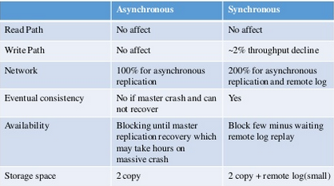

# Designing Data-Intensive Applications
 
## Chapter 5: Replication

### 1. What are some reasons to replicate your data?
- To keep data geographically close to your users (and thus reduce latency).
- To allow the system to continue working even if some of its parts have failed (and thus increase availability).
- To scale out the number of machines that can serve read queries (and thus increase read throughput).

### 2. Make a comparison of Synchronous vs. Asynchronous Replication

### 3. Summarize the process of setting up a follower
- Take a consistent snapshot of the leader’s database at some point in time—if possible, without taking a lock on the entire database. 
- Copy the snapshot to the new follower node.
- The follower connects to the leader and requests all the data changes that have happened since the snapshot was taken. This requires that the snapshot is associated with an exact position in the leader’s replication log.
- When the follower has processed the backlog of data changes since the snapshot, we say it has caught up. It can now continue to process data changes from the leader as they happen.

### 4.Write a brief description about the different replication logs methods
-**Statement-based replication**: the leader logs every write request (statement) that it executes and sends that statement log to its followers.
-**Write-ahead log (WAL) shipping**: the log is an append-only sequence of bytes containing all writes to the database. We can use the exact same log to build a replica on another node: besides writing the log to disk, the leader also sends it across the network to its followers.
-**Logical (row-based) log replication**: use different log formats for replication and for the storage engine, which allows the replication log to be decoupled from the  storage engine internals.
-**Trigger-based replication**: A trigger lets you register custom application code that is automatically executed when a data change (write transaction) occurs in a database system. The trigger hasthe opportunity to log this change into a separate table, from which it can be read by an external process.

### References
- https://www.slideshare.net/HBaseCon/synchronous-replication-for-hbase
 
