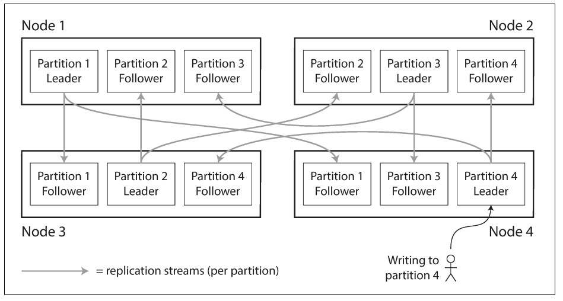

# Designing Data-Intensive Applications
 
## Chapter 6: Partitioning

### 1. Why is convenient to use partitions?
The main reason for wanting to partition data is scalability. Different partitions can be placed on different nodes in a shared-nothing cluster. Thus, a large dataset can be distributed across many disks, and the query load can be distributed across many processors.

### 2. How does work combining replication and partitioning?
Each node acts as leader for some partitions and follower for other partitions.

### 3.How can you avoid partition with disproportionately high load?
Assign records to nodes randomly. That would distribute the data quite evenly across the nodes.But it's not the best way, thus let’s assume for now that you have a simple key-value data model, in which you always access a record by its primary key. For example, in an old-fashioned paper encyclopedia, you look up an entry by its title; since all the entries are alphabetically sorted by title, you can quickly find the one you’re looking for.

### 4. Describe an example of partitioning by key range
For example, a column might have 10 rows between key values 1 and 1000 and the column might have 999 rows between key values 1001 and 2000. If the mapping includes multiple sources, use the same number of key ranges for each source.
When you define key range partitioning for a column, the Secure Agent reads the rows that are within the specified partition range. For example, if you configure two partitions for a column with the ranges as 10 through 20 and 30 through 40, the Secure Agent does not read the rows 20 through 30 because these rows are not within the specified partition range.
You can configure a partition key for fields of the following data types:
- String
- Any type of number data type. However, you cannot use decimals in key range values.
- Date/time type. Use the following format: MM/DD/YYYY HH24:MI:SS
