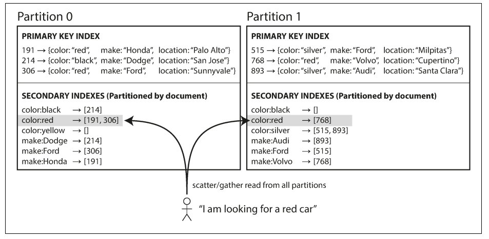
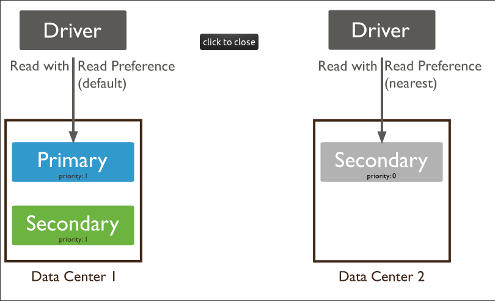

# Designing Data-Intensive Applications
 
## Chapter 6: Partitioning

### 1. Why is convenient to use partitions?
The main reason for wanting to partition data is scalability. Different partitions can be placed on different nodes in a shared-nothing cluster. Thus, a large dataset can be distributed across many disks, and the query load can be distributed across many processors.

### 2. How does work combining replication and partitioning?
Each node acts as leader for some partitions and follower for other partitions.

### 3.How can you avoid partition with disproportionately high load?
Assign records to nodes randomly. That would distribute the data quite evenly across the nodes.But it's not the best way, thus let’s assume for now that you have a simple key-value data model, in which you always access a record by its primary key. For example, in an old-fashioned paper encyclopedia, you look up an entry by its title; since all the entries are alphabetically sorted by title, you can quickly find the one you’re looking for.

### 4. Describe an example of partitioning by key range
A print encyclopedia is partitioned by key range. Volume 1 contains words starting with A and B, but volume 12 contains words starting with T, U, V, X, Y, and Z. Simply having one volume per two letters of the alphabet would lead to some volumes being much bigger than others.

### 5. When to use hash partitioning?
- To enable partial or full parallel partition-wise joins with likely equisized partitions.
- To distribute data evenly among the nodes of an MPP platform that uses Oracle Real Application Clusters. Consequently, you can minimize interconnect traffic when processing internode parallel statements.
- To use partition pruning and partition-wise joins according to a partitioning key that is mostly constrained by a distinct value or value list.
- To randomly distribute data to avoid I/O bottlenecks if you do not use a storage management technique that stripes and mirrors across all available devices.

### 6. What are skewed workloads?
Some partitions that have more data or queries than others. The presence of skew makes partitioning much less effective. In an extreme case, all the load could end up on one partition, so 9 out of 10 nodes are idle and your bottleneck is the single busy node.

### 7. How does partitioning secondary indexes by document work?

### 8. Describe what is scatter/gather and explain how it's used in any database
Querying a partitioned database. In MongoBD, read operations from secondary members of replica sets may not reflect the current state of the primary. Read preferences that direct read operations to different servers may result in non-monotonic reads.

### 9. What is rebalancing and why is it used for?
The process of moving load from one node in the cluster to another. And it's use for:
- For the load (data storage, read and write requests) to be shared fairly between the nodes in the cluster.
- The database continue accepting reads and writes.
- No more data than necessary should be moved between nodes, to make rebalancing fast and to minimize the network and disk I/O load.

### 10. What is Massively Parallel Processing (MPP)?
Massively parallel processing is a means of crunching huge amounts of data by distributing the processing over hundreds or thousands of processors, which might be running in the same box or in separate, distantly located computers. Each processor in an MPP system has its own memory, disks, applications, and instances of the operating system. The problem being worked on is divided into many pieces, which are processed simultaneously by the multiple systems.
Note

MMP is generally used in research, academic, and government environments running large, complex computer systems. It is seldom used on desktop machines or typical business servers, although there is a type of parallel processing called distributed computing that uses large numbers of ordinary PCs on a network to work together on a problem, dividing the task among multiple machines. One of the best-known examples of this type of processing is done on Berkeley Open Infrastructure for Network Computing (BOINC), which expanded from the original Search for Extraterrestrial Intelligence (SETI) project called SETI@Home. 

## References
- https://docs.oracle.com/database/121/VLDBG/GUID-F023D3ED-262F-4B19-950A-D3C8F8CDB4F4.htm#VLDBG1270
- https://docs.mongodb.com/manual/core/distributed-queries/
- https://www.sciencedirect.com/topics/computer-science/massively-parallel-processing
