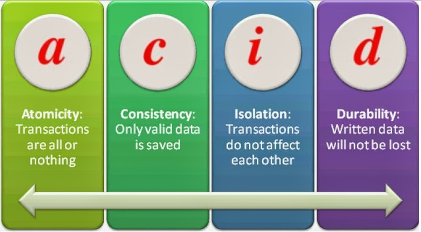
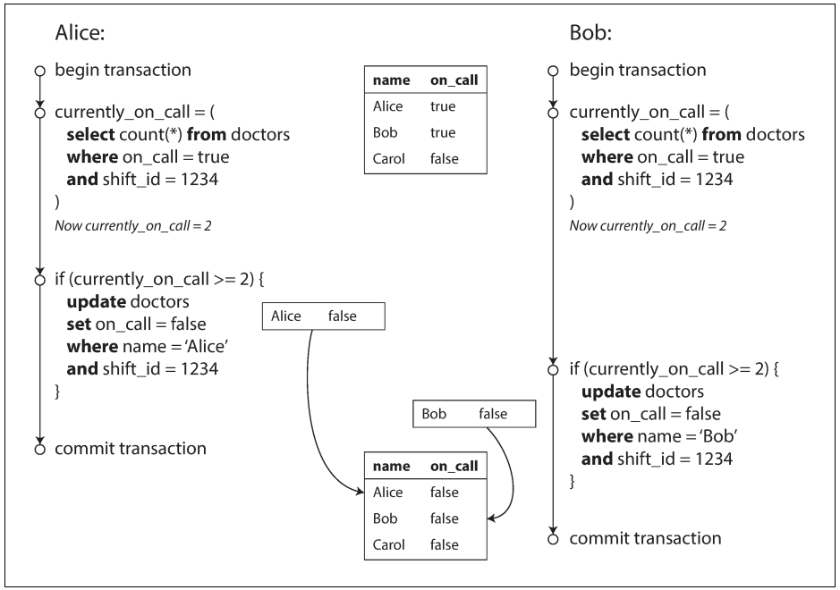

# Designing Data-Intensive Applications
 
## Chapter 7: Transactions

### 1. Dscribe what is transactions and why is it necessary
A transaction is a way for an application to group several reads and writes together into a logical unit. Transactions are not a law of nature; they were cre‐
ated with a purpose, namely to simplify the programming model for applications accessing a database. By using transactions, the application is free to ignore certain potential error scenarios and concurrency issues, because the database takes care ofthem instead (we call these safety guarantees).
 
### 2. Describe each concept of ACID

### 3.  Investigate about the benefits of ACID
- **Absolute Data Integrity and Safety**: Avoiding lost updates, dirty reads, stale reads, and enforcing app-specific integrity constraints are critical concerns for app developers. Solving these concerns directly at the database layer using the consistency provided by ACID transactions is a much simpler approach.
- **Simplified Concurrency Control**: Concurrent access to shared resources such as retail inventory, bank balance, and gaming leaderboards is unavoidable. Isolation in ACID transactions come to the rescue of app developers. E.g. when a database guarantees transactions with serializable isolation, developers can treat each transaction as if it were executed sequentially, even though it may actually be executed concurrently.
- **Intuitive Data Access Logic**: ACID compliant databases usually allow complex schema modeling and native support for multi-step data manipulation operations such as consistent secondary indexes. Business logic can be now represented more directly in the application code.
- **Future-Proofing Database Needs**: Durability is rarely up for debate in databases where stable persistence is a must-have. Hence our view is that “in-memory” only systems should not be even considered databases! However, there is always an urge on part of developers to trade-off either Atomicity or Consistency or Isolation or some combination of them in return for higher performance in distributed databases. 

### 4. In a relational data model, a row in one table often has a foreign key reference to a row in another table. (Similarly, in a graph-like data model, a vertex has edges to other vertices.), in this case how does Multi-object transactions works?
Multi-object transactions allow you to ensure that these references remain valid: when inserting several records that refer to one another, the foreign keys have to be correct and up to date, or the data becomes nonsensical.

### 5. Whats is the most basic level of transaction isolation and what its two guarantees?
Read committed. Its guarantees:
- When reading from the database, you will only see data that has been committed (no dirty reads).
- When writing to the database, you will only overwrite data that has been committed (no dirty writes).

### 6. What is snapshot isolation?
The idea is that each transaction reads from a consistent snapshot of the database—that is, the trans‐ action sees all the data that was committed in the database at the start of the transaction. Even if the data is subsequently changed by another transaction, each transaction sees only the old data from that particular point in time.

### 7. When can the lost update problem can occur?
If an application reads some value from the database, modifies it, and writes back the modified value (a read-modify-write cycle). If two transactions do this concurrently, one of the modifications can be lost, because the second write does not include the first modification.

### 8. Example of write skew

### 9. The simplest way of avoiding concurrency problems.
Removing the concurrency entirely: to execute only one transaction at a time, in serial order, on a single thread.By doing so, we completely sidestep the problem of detecting and preventing conflicts between transactions: the resulting isolation is by definition serializable.

### 10. How does the database know if a query result might have changed?
- Detecting reads of a stale MVCC object version (uncommitted write occurred before the read)
- Detecting writes that affect prior reads (the write occurs after the read)

## References
- https://blog.yugabyte.com/a-primer-on-acid-transactions/
